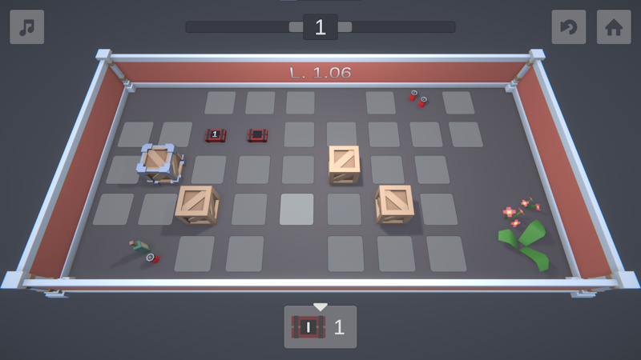

# BOMBSITE 2

## About

Bombsite 2 is a **puzzle** game, and a **remake** of [Bombsite](https://github.com/m-biernat/mj-32-explosions) made during [Mini Jam 32: Explosions](https://itch.io/jam/mini-jam-32-explosions).  The main goal is to **"destroy"** all elements present on the level. The player can **place bombs** in the highlighted areas. There are **two types** of bombs - active and passive. Bombs have a limited explosion range. For each level, there is a **time limit**, after which the placed **bombs explode** one by one. That's except of the passive bomb that must be affected by the other bombs to explode. The player has to progress through **10 levels** to beat the game.

You can **play in the browser** or **download for Windows and Android** by clicking [here](https://m-biernat.itch.io/bombsite-2).

A comment from the author: *I stopped developing this game some time ago and only managed to remake the original 10 levels. The reason was that I got exhausted with the project and solo game dev (I like to work with people and focus on programming). I over-complicated some code (KISS exists for a reason) and I didn't know where to push the game with level design. However, I was able to make the game easily extendible in several ways, such as adding new levels and bombs. I used some elements of [Scriptable Object Architecture](https://youtu.be/raQ3iHhE_Kk), implemented custom editor tools and tried to apply SOLID (I should have used a DI framework).*

## Tools & Dependencies

 - [Unity 2021.3.23](https://unity.com/releases/editor/whats-new/2021.3.23) - game engine 
    - used [new Input System](https://docs.unity3d.com/Packages/com.unity.inputsystem@1.5/), [Cinemachine](https://docs.unity3d.com/Packages/com.unity.cinemachine@2.8/), [Timeline](https://docs.unity3d.com/Packages/com.unity.timeline@1.6/), and [Shadergraph](https://docs.unity3d.com/Packages/com.unity.shadergraph@12.1/).
 - [DOTween](https://assetstore.unity.com/packages/tools/animation/dotween-hotween-v2-27676) - to animate stuff;
 - [Blender 2.93](https://www.blender.org/download/releases/2-93/) - to create 3D models.

## Credits

 - **Michał Biernat** @[m-biernat](https://github.com/m-biernat)

BGM and SFX are from [Freesound.org](https://freesound.org/), licensed under [CC0](https://creativecommons.org/publicdomain/zero/1.0/).

Some 3D models and icons are from [Kenney](https://www.kenney.nl/), licensed under [CC0](https://creativecommons.org/publicdomain/zero/1.0/).

## License

All rights reserved ([no license](https://choosealicense.com/no-permission/)): 
 - You **can** view (peek into the code and assets) and fork this repository;
 - You **cannot** reproduce, distribute, or create derivative works;
 - You **can** play the game (*"BOMBSITE 2"*) free of charge via the provided channels.
